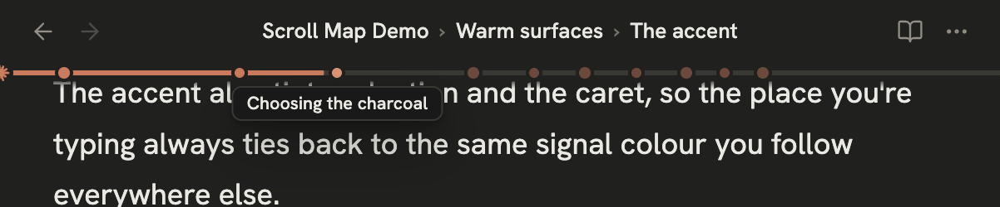
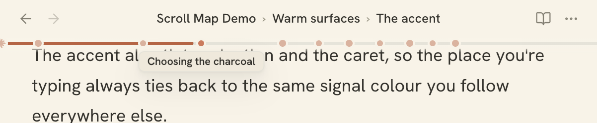
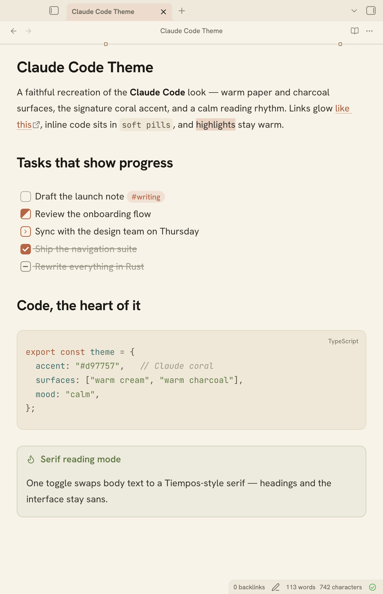
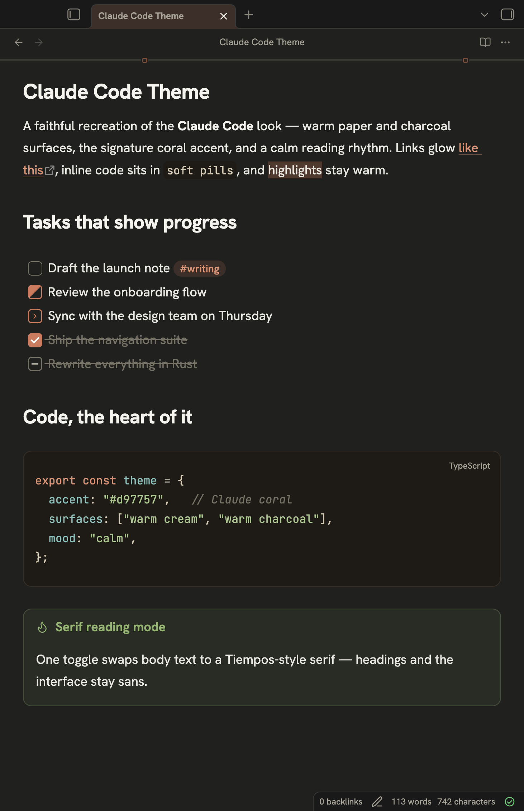

# Claude Code Orange

A faithful recreation of the look and feel of **Claude Code in the Claude mobile app**, for [Obsidian](https://obsidian.md). Warm cream / charcoal surfaces, the signature Claude coral accent, a Styrene-style grotesque typeface, and a calm reading rhythm — in both **light** and **dark**.

| Light | Dark |
| --- | --- |
| Warm paper cream `#f9f3e7` | Warm charcoal `#262624` |
| Coral links `#b0532f` | Coral links `#e8916f` |

## What it recreates

- **Color** — Claude's warm neutral backgrounds (no cold grays), the coral accent (`#d97757` / Crail `#c15f3c`) driving links, the active note marker, tags, checkboxes and highlights.
- **Type** — a grotesque sans for the interface and body (like Claude's *Styrene B*), with an optional serif reading mode (like *Tiempos Text*) and a clean monospace for code.
- **Bold** — strong text uses a heavier weight *and* the high-contrast heading color, the way emphasis reads in Claude.
- **Links** — coral, underlined with a soft offset; brighten on hover.
- **Code** — framed code cards with soft corners, pill-shaped inline code, and a restrained, warm syntax palette tuned to the Claude aesthetic.
- **Everything else** — callouts, tables, blockquotes, task lists, the file explorer, command palette, inputs and graph view all follow the same language.

## Task states

Beyond the standard empty and done checkboxes, the theme styles three extra task markers so a list shows real progress at a glance. Type the character between the brackets — e.g. `- [/] Draft the intro`:

| Marker | Looks like | Meaning |
| --- | --- | --- |
| `- [ ]` | empty outlined box | to do |
| `- [/]` | half-filled coral box, split on the diagonal | in progress |
| `- [>]` | coral right-chevron | forwarded / scheduled for another day |
| `- [x]` | filled coral box with a white tick | done — text struck through |
| `- [-]` | muted box with a dash | cancelled — text struck through and faded |

Works in both reading view and Live Preview, on desktop and mobile.

## Navigation — breadcrumb, progress bar & scroll map

Three layers that answer *where am I* and *how far along am I* in long notes:

<p align="center">
  
  
</p>

- **Heading breadcrumb in the title bar** — with the community plugin [Another Sticky Headings](https://github.com/zhouhua/obsidian-sticky-headings) installed, scrolling into a section replaces the note title with a clickable trail: the page name in coral, then the headings above your position (`Page › Section › Subsection`). Scroll back to the top and the plain title returns. Desktop only — on mobile the plugin keeps its regular stacked view. Toggle under *Style Settings → Plugins*.
- **Scroll progress bar** — a thin coral fill at the seam under the title row tracks your position as you read. Pure CSS (scroll-driven animation), spans the editor and resizes with the sidebars. On mobile it pins to the bottom of the editor area instead. Toggle under *Style Settings → Editor*.
- **Heading dots (Claude Scroll Map)** — a tiny companion plugin in [`companion/claude-scroll-map`](companion/claude-scroll-map) drops a marker on the bar for every heading: a Claude starburst for each H1, coral circles for H2/H3 (larger circle = higher level). Each marker starts faded and fills coral the moment its heading reaches the top of the view, in step with the progress fill — so the run of solid markers shows exactly how far you've read, never lighting a section before you get to it. Hover a dot for the heading name, hover anywhere on the bar for the section you'd land in, click to jump. Overlapping dots merge automatically. Desktop only — mobile stays progress-bar-only. Install by copying the folder to `<vault>/.obsidian/plugins/claude-scroll-map/` and enabling it in *Settings → Community plugins*.

Each layer works without the others: theme alone gives you the progress bar; add either plugin for its part.

## Fonts

Claude's real typefaces (**Styrene B**, **Tiempos Text**, **Galaxie Copernicus**) are commercial and can't be bundled, so the theme loads close, free Google Fonts automatically:

| Claude font | Free lookalike used | Role |
| --- | --- | --- |
| Styrene B | **Hanken Grotesk** | interface + body |
| Tiempos Text | **Source Serif 4** | serif reading mode |
| code face | **JetBrains Mono** | code blocks / inline |

If you own the real fonts and install them on your system, they sit at the front of every font stack and will be used automatically — no config needed. The Google Fonts `@import` requires an internet connection on first load (Obsidian then caches them).

## Install

### Manually (works today)

1. Download `manifest.json` and `theme.css` from this repo.
2. In your vault, put them in a folder named exactly **`Claude Code`** inside `.obsidian/themes/`:
   ```
   <your-vault>/.obsidian/themes/Claude Code/manifest.json
   <your-vault>/.obsidian/themes/Claude Code/theme.css
   ```
3. In Obsidian: **Settings → Appearance → Themes → Manage → select "Claude Code"**.
4. Pick a color scheme under **Settings → Appearance → Base color scheme**. Both *Light* and *Dark* are individually tuned.

### Automatic light/dark switching

Both schemes ship in the theme, so Obsidian can follow your device. Set **Settings → Appearance → Base color scheme → "Adapt to system"** and Obsidian will switch between the Claude Code light and dark palettes automatically with your OS / device light–dark setting — no extra configuration needed.

## Options (Style Settings)

Install the community plugin **[Style Settings](https://github.com/mgmeyers/obsidian-style-settings)** to unlock toggles under *Settings → Style Settings → Claude Code*:

- **Serif reading mode** — switch note body text to the Tiempos-style serif.
- **Serif headings** / **Monospace headings** — restyle headings.
- **Body font size**, **line height**, **readable line length** sliders.
- **Limit line length** — cap note width at a readable measure even with Obsidian's own "Readable line length" off.
- **Accent color** pickers for light and dark mode.
- **Dark mode tuning** — live dials for dark-mode reading comfort: **text brightness**, **text weight** (variable-font aware), and **background darkness** (deepens all dark surfaces together).
- **Loud code blocks** — on (default) gives code blocks a blue frame so they stand out; off keeps them warm, in line with the coral theme.
- **Highlight active line** — a very light tint behind the editor row your cursor is on (on by default).
- **Scroll progress bar** — the coral reading-position bar (on by default).
- **Sticky headings in the title bar** — the breadcrumb integration described above (on by default; inert without the plugin).

All defaults match the Claude Code look, so the theme looks right with the plugin not installed too.

## Preview

Light and dark, side by side — inline title, coral links, warm highlights, the five task states, a framed code card, and a callout:

<p align="center">
  
  
</p>

## Releasing (maintainers)

The Obsidian directory reads GitHub **Releases**, not the repo — it needs a release whose tag exactly matches the `version` in `manifest.json` (no `v` prefix). After bumping that version and committing:

```bash
./release.sh                       # tags + pushes + creates the release
./release.sh --notes "What's new"  # with custom release notes
```

The script reads the version from `manifest.json`, refuses to run on a dirty tree or an existing tag, and attaches `theme.css` + `manifest.json` to the release.

## License

MIT. Not affiliated with or endorsed by Anthropic. "Claude" and "Claude Code" are trademarks of Anthropic; this is a community theme that imitates the aesthetic using free, redistributable fonts.
