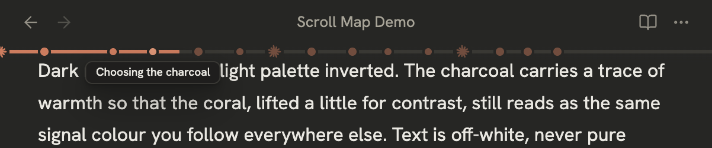
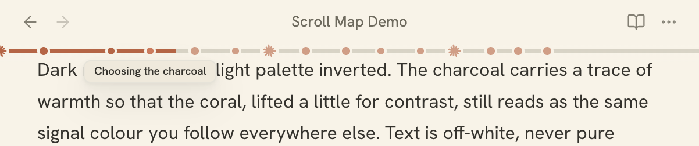
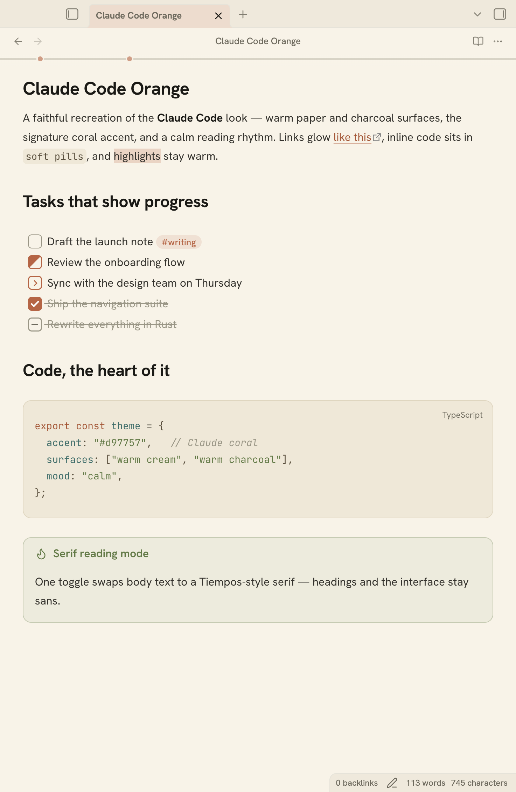
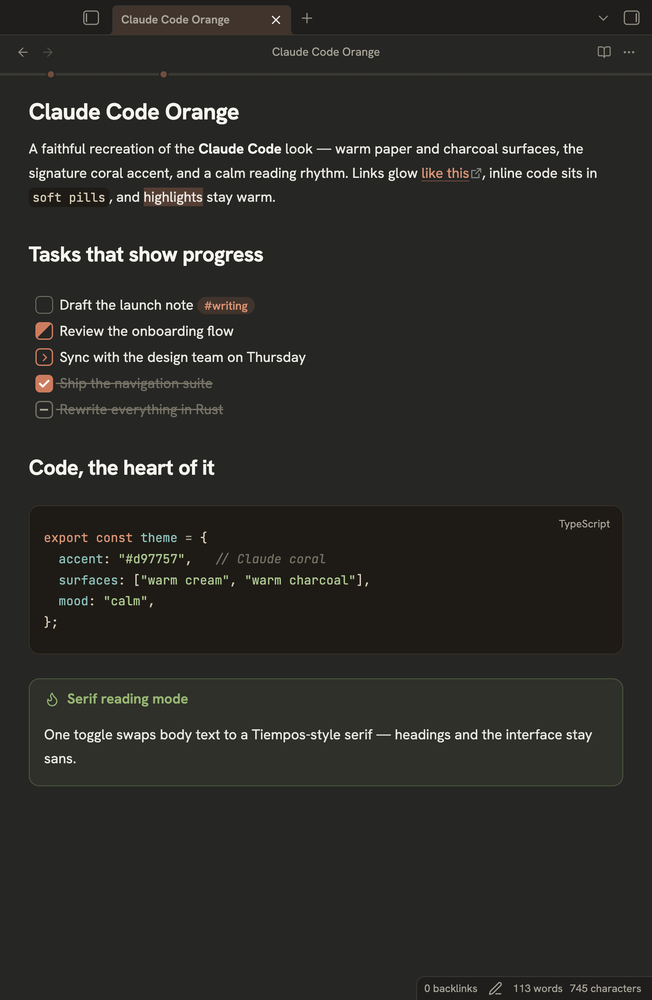

# Claude Code Orange

A faithful recreation of the look and feel of **Claude Code in the Claude mobile app**, for [Obsidian](https://obsidian.md). Warm cream / charcoal surfaces, the signature Claude coral accent, a Styrene-style grotesque typeface, and a calm reading rhythm — in both **light** and **dark**.

| Light | Dark |
| --- | --- |
| Warm paper cream `#f9f3e7` | Warm charcoal `#262624` |
| Coral links `#b0532f` | Coral links `#e8916f` |

## What it recreates

- **Color** — Claude's warm neutral backgrounds (no cold grays), the coral accent (`#d97757` / Crail `#c15f3c`) driving links, the active note marker, tags, checkboxes and highlights.
- **Type** — a grotesque sans for the interface and body (like Claude's *Styrene B*), with an optional serif reading mode (like *Tiempos Text*) and a clean monospace for code.
- **Bold** — strong text uses a heavier weight *and* the high-contrast heading color, the way emphasis reads in Claude.
- **Links** — coral, underlined with a soft offset; brighten on hover.
- **Code** — framed code cards with soft corners, pill-shaped inline code, and a restrained, warm syntax palette tuned to the Claude aesthetic.
- **Everything else** — callouts, tables, blockquotes, task lists, the file explorer, command palette, inputs and graph view all follow the same language.

## Task states

Beyond the standard empty and done checkboxes, the theme styles three extra task markers so a list shows real progress at a glance. Type the character between the brackets — e.g. `- [/] Draft the intro`:

| Marker | Looks like | Meaning |
| --- | --- | --- |
| `- [ ]` | empty outlined box | to do |
| `- [/]` | half-filled coral box, split on the diagonal | in progress |
| `- [>]` | coral right-chevron | forwarded / scheduled for another day |
| `- [x]` | filled coral box with a white tick | done — text struck through |
| `- [-]` | muted box with a dash | cancelled — text struck through and faded |

Works in both reading view and Live Preview, on desktop and mobile — including reading view with the [Tasks](https://github.com/obsidian-tasks-group/obsidian-tasks) plugin installed, which re-renders task items in its own markup.

## Navigation — progress bar & scroll map

Two layers that answer *how far along am I* in long notes:

<p align="center">
  
  
</p>

- **Scroll progress bar** — a thin coral fill at the seam under the title row tracks your position as you read. Pure CSS (scroll-driven animation), spans the editor and resizes with the sidebars. On mobile it pins to the bottom of the editor area instead. Toggle under *Style Settings → Editor*.

  *Engine support:* the fill uses [CSS scroll-driven animations](https://developer.mozilla.org/en-US/docs/Web/CSS/CSS_scroll-driven_animations), which desktop Obsidian (Chromium) and Obsidian on Android support. On an engine without them (notably some iOS builds) the bar simply stays empty — nothing breaks, and the companion plugin's heading dots still work as click targets. The fill is scroll-linked, not autonomous motion, so it intentionally keeps tracking your position when the OS *Reduce motion* setting is on.
- **Heading dots (Claude Scroll Map)** — a tiny companion plugin in [`companion/claude-scroll-map`](companion/claude-scroll-map) drops a marker on the bar for every heading: a Claude starburst for each H1, coral circles for H2/H3 (larger circle = higher level). Each marker starts faded and fills coral the moment its heading reaches the top of the view, in step with the progress fill — so the run of solid markers shows exactly how far you've read, never lighting a section before you get to it. Hover a dot for the heading name, hover anywhere on the bar for the section you'd land in, click to jump. Overlapping dots merge automatically. On mobile the markers ride the bottom progress bar, cut in half at the screen edge, and are purely visual: no hover, no tap-to-jump. The plugin also keeps the editor's text still while a sidebar opens or closes; without it, Obsidian's editor lets the lines drift for a moment and snap back.

  **Install the companion** (not in the community store yet):
  ```bash
  ./scripts/install-scroll-map.sh /path/to/your/vault
  ```
  from a checkout of this repo — or copy the three files in [`companion/claude-scroll-map`](companion/claude-scroll-map) into `<vault>/.obsidian/plugins/claude-scroll-map/` by hand. Then enable **Claude Scroll Map** in *Settings → Community plugins* (re-run the script and reload Obsidian to update it later).

The theme alone gives you the progress bar; the plugin adds the dots.

## At a glance

Small cues that tell you what is what without reading for it:

- **Links that lead nowhere look different.** A `[[link]]` to a note that doesn't exist yet is the same coral, but faded with a dotted underline — in reading view and Live Preview.
- **Only the focused pane gets the coral tab.** With several panes open, the active tab of the pane that takes your keystrokes is coral-tinted; other panes' active tabs merge with their note instead.
- **Task states** read as shapes, not characters (see above).
- **One tempo for every state change.** Hover and focus on files, tabs, buttons and properties ease in over 120 ms instead of snapping; the scroll-map strip fades in when a note opens. Keyboard focus shows one coral ring everywhere.

## Fonts

Claude's real typefaces (**Styrene B**, **Tiempos Text**, **Galaxie Copernicus**) are commercial and can't be bundled, so the theme loads close, free Google Fonts automatically:

| Claude font | Free lookalike used | Role |
| --- | --- | --- |
| Styrene B | **Hanken Grotesk** | interface + body |
| Tiempos Text | **Source Serif 4** | serif reading mode |
| code face | **JetBrains Mono** | code blocks / inline |

If you own the real fonts and install them on your system, they sit at the front of every font stack and will be used automatically — no config needed.

The lookalikes load from Google Fonts over the web. This is an intentional tradeoff: the theme stays a single lightweight CSS file with no bundled font payload. The `@import` needs an internet connection on first load (Obsidian usually caches the files afterwards); offline, or with Google's CDN blocked, the theme still works and text falls back to the system fonts in each stack.

Until the web fonts arrive, text is set in a *metric-matched* local fallback (Arial / Roboto scaled to Hanken Grotesk's glyph widths, Georgia scaled to Source Serif 4's), so the swap doesn't reflow the page — no jump on first launch or on a slow connection.

## Install

### Manually (works today)

1. Download `manifest.json` and `theme.css` from this repo.
2. In your vault, put them in a folder named exactly **`Claude Code Orange`** inside `.obsidian/themes/`:
   ```
   <your-vault>/.obsidian/themes/Claude Code Orange/manifest.json
   <your-vault>/.obsidian/themes/Claude Code Orange/theme.css
   ```
3. In Obsidian: **Settings → Appearance → Themes → Manage → select "Claude Code Orange"**.
4. Pick a color scheme under **Settings → Appearance → Base color scheme**. Both *Light* and *Dark* are individually tuned.

### Automatic light/dark switching

Both schemes ship in the theme, so Obsidian can follow your device. Set **Settings → Appearance → Base color scheme → "Adapt to system"** and Obsidian will switch between the theme's light and dark palettes automatically with your OS / device light–dark setting — no extra configuration needed.

## Options (Style Settings)

Install the community plugin **[Style Settings](https://github.com/mgmeyers/obsidian-style-settings)** to unlock toggles under *Settings → Style Settings → Claude Code Orange*:

- **Serif reading mode** — switch note body text to the Tiempos-style serif.
- **Serif headings** / **Monospace headings** — restyle headings.
- **Body font size**, **line height**, **readable line length** sliders.
- **Limit line length** — cap note width at a readable measure even with Obsidian's own "Readable line length" off.
- **Accent color** pickers for light and dark mode.
- **Light mode tuning** — live dials for light-mode reading comfort: **text darkness**, **text weight** (variable-font aware), and **background depth** (deepens all cream surfaces together). Defaults reproduce the classic palette exactly.
- **Dark mode tuning** — the same dials for dark mode: **text brightness**, **text weight**, and **background darkness** (deepens all dark surfaces together).
- **Loud code blocks** — on (default) gives code blocks a blue frame so they stand out; off keeps them warm, in line with the coral theme.
- **Highlight active line** — a very light tint behind the editor row your cursor is on (on by default).
- **Scroll progress bar** — the coral reading-position bar (on by default).

All defaults match the Claude Code look, and without the plugin every option keeps the default listed above — progress bar and active-line tint on, loud code blocks on. (The preview images show code blocks with **Loud code blocks** turned off.)

## Preview

Light and dark, side by side — inline title, coral links, warm highlights, the five task states, a framed code card, and a callout:

<p align="center">
  
  
</p>

## Releasing (maintainers)

The Obsidian directory reads GitHub **Releases**, not the repo — it needs a release whose tag exactly matches the `version` in `manifest.json` (no `v` prefix). After bumping that version, adding a matching entry to `versions.json`, and committing:

```bash
./release.sh                       # tags + pushes + creates the release
./release.sh --notes "What's new"  # with custom release notes
./release.sh --verify 1.5.0        # read-only: does a release have all its files?
```

The script reads the version from `manifest.json` and first runs `scripts/check.sh` (JSON, the `versions.json` entry, `theme.css` structure, plugin syntax). It refuses to run on a dirty tree or a tag that already exists on another commit, attaches `theme.css`, `manifest.json` and `versions.json`, then verifies they are really attached and re-uploads any that are missing. If a run stops part-way, just run it again: a tag already on `HEAD` resumes instead of refusing. Prefer real `--notes` listing user-visible changes over the default line.

`./tests/release.test.sh` exercises all of this against a fake `gh` and a local bare remote — run it after changing `release.sh`.

## License & affiliation

MIT.

**Claude Code Orange** is an unofficial community theme for Obsidian. Its visual style is inspired by Claude and Claude Code, which are products of Anthropic — but this project is **not affiliated with, endorsed by, or supported by Anthropic**. "Claude" and "Claude Code" are trademarks of Anthropic, PBC. Anthropic's commercial typefaces are not bundled; the theme uses free, redistributable Google Fonts lookalikes instead.
